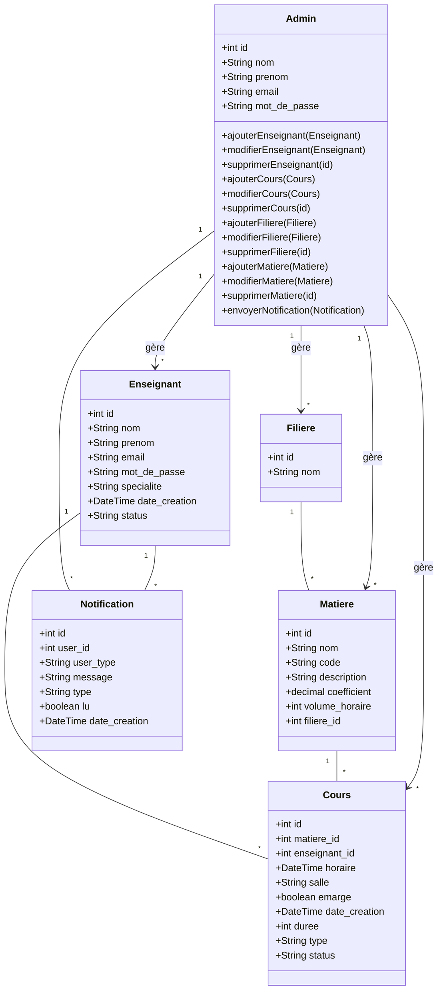

```mermaid
classDiagram
    class Admin {
        +int id
        +String nom
        +String prenom
        +String email
        +String mot_de_passe
        +ajouterEnseignant(Enseignant)
        +modifierEnseignant(Enseignant)
        +supprimerEnseignant(id)
        +ajouterCours(Cours)
        +modifierCours(Cours)
        +supprimerCours(id)
        +ajouterFiliere(Filiere)
        +modifierFiliere(Filiere)
        +supprimerFiliere(id)
        +ajouterMatiere(Matiere)
        +modifierMatiere(Matiere)
        +supprimerMatiere(id)
        +envoyerNotification(Notification)
    }

    class Enseignant {
        +int id
        +String nom
        +String prenom
        +String email
        +String mot_de_passe
        +String specialite
        +DateTime date_creation
        +String status
    }

    class Cours {
        +int id
        +int matiere_id
        +int enseignant_id
        +DateTime horaire
        +String salle
        +boolean emarge
        +DateTime date_creation
        +int duree
        +String type
        +String status
    }

    class Matiere {
        +int id
        +String nom
        +String code
        +String description
        +decimal coefficient
        +int volume_horaire
        +int filiere_id
    }

    class Filiere {
        +int id
        +String nom
    }

    class Notification {
        +int id
        +int user_id
        +String user_type
        +String message
        +String type
        +boolean lu
        +DateTime date_creation
    }

    Admin "1" --> "*" Enseignant : gère
    Admin "1" --> "*" Cours : gère
    Admin "1" --> "*" Matiere : gère
    Admin "1" --> "*" Filiere : gère
    Filiere "1" -- "*" Matiere
    Matiere "1" -- "*" Cours
    Enseignant "1" -- "*" Cours
    Enseignant "1" -- "*" Notification
    Admin "1" -- "*" Notification
```
