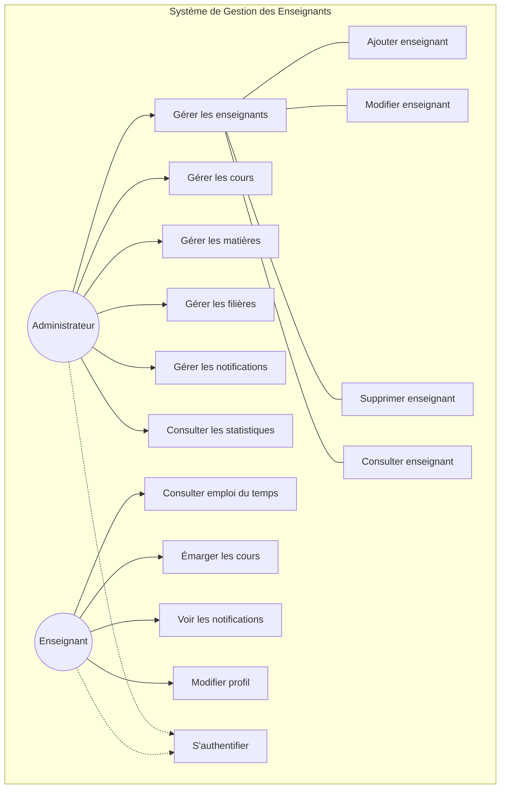

## Description des Cas d'Utilisation

### Administrateur

1. **Gestion des Enseignants**
   - Ajouter un nouvel enseignant
   - Modifier les informations d'un enseignant
   - Supprimer un enseignant
   - Consulter la liste des enseignants

2. **Gestion des Cours**
   - Planifier un nouveau cours
   - Modifier un cours existant
   - Supprimer un cours
   - Suivre l'émargement des cours

3. **Gestion des Matières**
   - Créer une nouvelle matière
   - Modifier une matière
   - Supprimer une matière
   - Affecter des matières aux filières

4. **Gestion des Filières**
   - Créer une nouvelle filière
   - Modifier une filière
   - Supprimer une filière

5. **Gestion des Notifications**
   - Envoyer des notifications
   - Gérer les notifications système

### Enseignant

1. **Emploi du temps**
   - Consulter son emploi du temps
   - Voir les détails des cours

2. **Émargement**
   - Émarger les cours effectués
   - Consulter l'historique des émargements

3. **Notifications**
   - Recevoir des notifications
   - Marquer comme lu/non lu

4. **Profil**
   - Consulter son profil
   - Modifier ses informations personnelles
   - Changer son mot de passe
```
